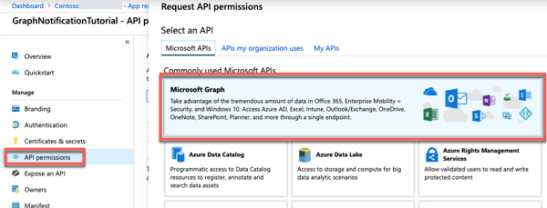
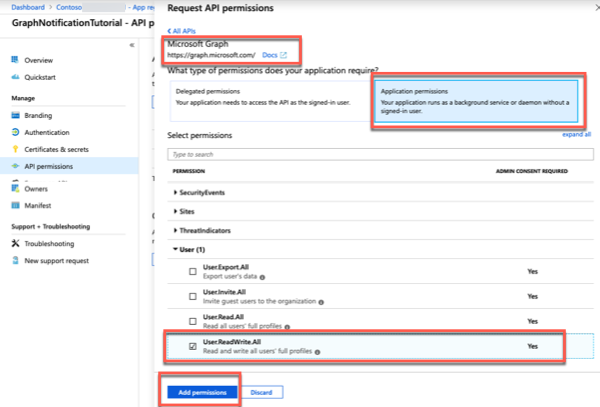

<!-- markdownlint-disable MD002 MD041 -->

Neste exercício, você criará um novo registro de aplicativo Web do Azure AD usando o centro de administração do Azure Active Directory e concederá consentimento do administrador aos escopos de permissão necessários.

1. Abra um navegador e navegue até o [centro de administração do Azure Activehttps://aad.portal.azure.com)Directory (](https://aad.portal.azure.com). Faça logon usando uma **conta corporativa ou de estudante**.

1. Selecione **Azure Active Directory** na navegação à esquerda e, em seguida, selecione **registros de aplicativo** em **gerenciar**.

    

1. Selecione **Novo registro**. Na página **registrar um aplicativo**

    

    Defina os valores da seguinte maneira:

    - **Nome**: GraphNotificationTutorial
    - **Tipos de conta com suporte**: contas em qualquer diretório organizacional e contas pessoais da Microsoft
    - **URI**de redirecionamento: Web >http://localhost

    

    Selecione **registrar**.

1. Na página **GraphNotificationTutorial** , copie o valor da ID do **aplicativo (cliente)** e da **ID de diretório (locatário)** salve-o, você precisará deles na próxima etapa.

    

1. Selecione **gerenciar > certificados & segredos**. 

    Selecione **novo segredo do cliente**.

    Insira um valor em **Descrição** e selecione uma das opções para **expirar** e selecione **Adicionar**.

    

    

1. Copie o valor secreto do cliente antes de sair desta página. Você precisará dele na próxima etapa.

    > [!IMPORTANT]
    > Este segredo do cliente nunca é mostrado novamente, portanto, copie-o agora.

    

1. Selecione **gerenciar permissões de API de >**.

    Selecione **Adicionar uma permissão** e selecione **Microsoft Graph**.

    

    Selecione **permissão de aplicativo**, expanda o grupo de **usuários** e selecione o escopo **User. ReadWrite. All** .

    Selecione **adicionar permissões** para salvar suas alterações.

    

    

O aplicativo solicita uma permissão de aplicativo com o escopo **User. ReadWrite. All** . Essa permissão exige o consentimento administrativo.

Selecione **conceder consentimento do administrador para contoso**e, em seguida, selecione **Sim** para concordar com este aplicativo e conceder o acesso do aplicativo ao locatário usando os escopos especificados.

