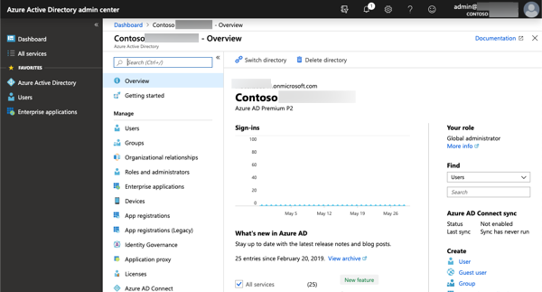
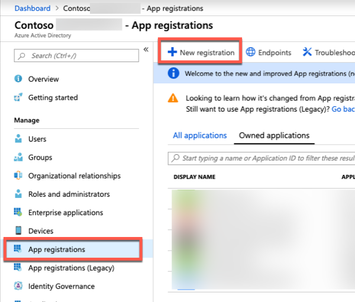
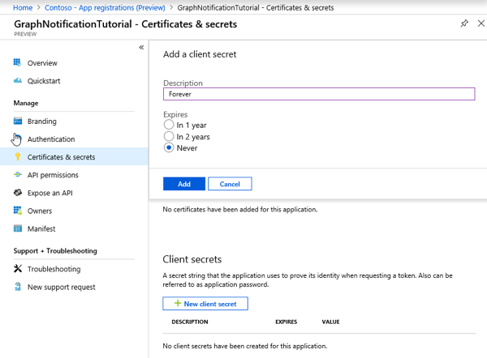

<!-- markdownlint-disable MD002 MD041 -->

Neste exercício, você criará um novo registro de aplicativo Web do Azure AD usando o centro de administração do Azure Active Directory e concederá consentimento do administrador aos escopos de permissão necessários.In this exercise, you will create a new Azure AD web application registration using the Azure Active Directory admin center and grant administrator consent to the required permission scopes.

1. Abra um navegador e navegue até o [centro de administração do Azure Activehttps://aad.portal.azure.com)Directory (](https://aad.portal.azure.com).Open a browser and navigate to the [Azure Active Directory admin center (https://aad.portal.azure.com)](https://aad.portal.azure.com). Faça logon usando uma **conta corporativa ou de estudante**.Login using a **Work or School Account**.

1. Selecione **Azure Active Directory** na navegação à esquerda e, em seguida, selecione **registros de aplicativo** em **gerenciar**.Select **Azure Active Directory** in the left-hand navigation, then select **App registrations** under **Manage**.

    

1. Selecione **Novo registro**.Select **New registration**. Na página **registrar um aplicativo**On the **Register an application** page

    

    Defina os valores da seguinte maneira:Set the values as follows:

    - **Nome**: GraphNotificationTutorial**Name**: GraphNotificationTutorial
    - **Tipos de conta com suporte**: contas em qualquer diretório organizacional e contas pessoais da Microsoft**Supported account types**: Accounts in any organizational directory and personal Microsoft accounts
    - **URI**de redirecionamento: Web >http://localhost**Redirect URI**: Web > http://localhost

    

    Selecione **registrar**.Select **Register**.

1. Na página **GraphNotificationTutorial** , copie o valor da ID do **aplicativo (cliente)** e da **ID de diretório (locatário)** salve-o, você precisará deles na próxima etapa.On the **GraphNotificationTutorial** page, copy the value of the **Application (client) ID** and **Directory (tenant) ID** save it, you will need them in the next step.

    

1. Selecione **gerenciar > certificados & segredos**.Select **Manage > Certificates & secrets**. 

    Selecione **novo segredo do cliente**.Select **New client secret**.

    Insira um valor em **Descrição** e selecione uma das opções para **expirar** e selecione **Adicionar**.Enter a value in **Description** and select one of the options for **Expires** and select **Add**.

    

    

1. Copie o valor secreto do cliente antes de sair desta página.Copy the client secret value before you leave this page. Você precisará dele na próxima etapa.You will need it in the next step.

    > [!IMPORTANT]
    > Este segredo do cliente nunca é mostrado novamente, portanto, copie-o agora.This client secret is never shown again, so make sure you copy it now.

    

1. Selecione **gerenciar permissões de API de >**.Select **Manage > API Permissions**.

    Selecione **Adicionar uma permissão** e selecione **Microsoft Graph**.Select **Add a permission** and select **Microsoft Graph**.

    

    Selecione **permissão de aplicativo**, expanda o grupo de **usuários** e selecione o escopo **User. ReadWrite. All** .Select **Application Permission**, expand the **User** group and select **User.ReadWrite.All** scope.

    Selecione **adicionar permissões** para salvar suas alterações.Select **Add permissions** to save your changes.

    

    

O aplicativo solicita uma permissão de aplicativo com o escopo **User. ReadWrite. All** .The application requests an application permission with the **User.ReadWrite.All** scope. Essa permissão exige o consentimento administrativo.This permission requires administrative consent.

Selecione **conceder consentimento do administrador para contoso**e, em seguida, selecione **Sim** para concordar com este aplicativo e conceder o acesso do aplicativo ao locatário usando os escopos especificados.Select **Grant admin consent for Contoso**, then select **Yes** to consent this application and grant the application access to your tenant using the scopes you specified.

