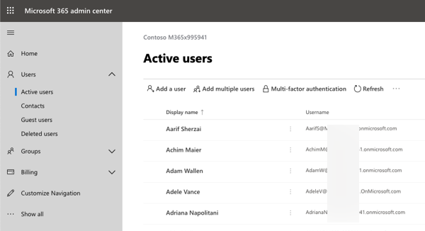

<!-- markdownlint-disable MD002 MD041 -->

Crie uma configuração de inicialização para depurar o aplicativo no Visual Studio Code.

No Visual Studio Code, selecione **Debug > Open**Configurations.

  

Quando solicitado a selecionar um ambiente, selecione **.NET Core**.

  

> [!NOTE]
> Por padrão, a configuração de início do .NET Core abrirá um navegador e navegará até a URL padrão para o aplicativo ao iniciar o depurador. Para este aplicativo, gostaríamos de navegar até a URL do NGrok. Se você deixar a configuração de inicialização como está, sempre que depurar o aplicativo, será exibida uma página quebrada. Você pode simplesmente alterar a URL ou alterar a configuração de inicialização para não iniciar o navegador:

Atualize a configuração de lançamento do depurador do Visual Studio:

  1. No Visual Studio Code, abra o arquivo **. vscode/Launch. JSON**.
  1. Localize a seguinte seção na configuração padrão:

      ```json
      "launchBrowser": {
        "enabled": true
      },
      ```

  1. Defina a `enabled` Propriedade como `false`.
  1. Salve suas alterações.

### <a name="test-the-application"></a>Teste o aplicativo:

No Visual Studio Code, selecione **Debug > iniciar a depuração** para executar o aplicativo. VS o código criará e apresentará o aplicativo.

Depois de ver o seguinte na janela do **console de depuração** ...


... Abra um navegador e navegue até **http://localhost:5000/api/notifications** para inscrever-se nas notificações de alteração. Se tiver êxito, você verá a saída que inclui uma ID de assinatura como a seguinte:


Seu aplicativo agora está inscrito para receber notificações do Microsoft Graph quando uma atualização é feita em qualquer usuário no locatário do Office 365.

Acionar uma notificação:

1. Abra um navegador e navegue até o [centro de administração do Microsofthttps://admin.microsoft.com/AdminPortal)365 (](https://admin.microsoft.com/AdminPortal).
1. Se for solicitado a fazer logon, entre usando uma conta de administrador.
1. Selecione **usuários > usuários ativos**.

    

1. Selecione um usuário ativo e selecione **Editar** para suas **informações de contato**.

    

1. Atualize o valor do **número de telefone** com um novo número e selecione **salvar**.

    No **console de depuração**de código do Visual Studio, você verá uma notificação foi recebida. Às vezes, isso pode levar alguns minutos para chegar. Um exemplo de saída está abaixo de:

    ```shell
    Received notification: 'Users/7a7fded6-0269-42c2-a0be-512d58da4463', 7a7fded6-0269-42c2-a0be-512d58da4463
    ```

Isso indica que o aplicativo recebeu com êxito a notificação do Microsoft Graph para o usuário especificado na saída. Você pode usar essas informações para consultar o Microsoft Graph para obter os detalhes completos, se quiser sincronizar seus detalhes no aplicativo.