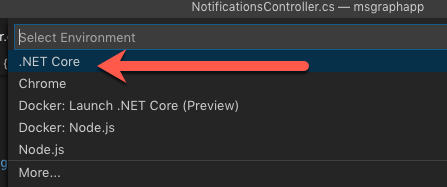
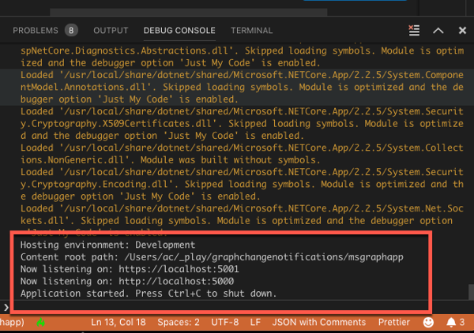

<!-- markdownlint-disable MD002 MD041 -->

<span data-ttu-id="b712e-101">Crie uma configuração de inicialização para depurar o aplicativo no Visual Studio Code.</span><span class="sxs-lookup"><span data-stu-id="b712e-101">Create a launch configuration to debug the application in Visual Studio Code.</span></span>

<span data-ttu-id="b712e-102">No Visual Studio Code, selecione **Debug > Open**Configurations.</span><span class="sxs-lookup"><span data-stu-id="b712e-102">Within Visual Studio Code, select **Debug > Open Configurations**.</span></span>

  

<span data-ttu-id="b712e-104">Quando solicitado a selecionar um ambiente, selecione **.NET Core**.</span><span class="sxs-lookup"><span data-stu-id="b712e-104">When prompted to select an environment, select **.NET Core**.</span></span>

  

> [!NOTE]
> <span data-ttu-id="b712e-106">Por padrão, a configuração de início do .NET Core abrirá um navegador e navegará até a URL padrão para o aplicativo ao iniciar o depurador.</span><span class="sxs-lookup"><span data-stu-id="b712e-106">By default, the .NET Core launch configuration will open a browser and navigate to the default URL for the application when launching the debugger.</span></span> <span data-ttu-id="b712e-107">Para este aplicativo, gostaríamos de navegar até a URL do NGrok.</span><span class="sxs-lookup"><span data-stu-id="b712e-107">For this application, we instead want to navigate to the NGrok URL.</span></span> <span data-ttu-id="b712e-108">Se você deixar a configuração de inicialização como está, sempre que depurar o aplicativo, será exibida uma página quebrada.</span><span class="sxs-lookup"><span data-stu-id="b712e-108">If you leave the launch configuration as is, each time you debug the application it will display a broken page.</span></span> <span data-ttu-id="b712e-109">Você pode simplesmente alterar a URL ou alterar a configuração de inicialização para não iniciar o navegador:</span><span class="sxs-lookup"><span data-stu-id="b712e-109">You can just change the URL, or change the launch configuration to not launch the browser:</span></span>

<span data-ttu-id="b712e-110">Atualize a configuração de lançamento do depurador do Visual Studio:</span><span class="sxs-lookup"><span data-stu-id="b712e-110">Update the Visual Studio debugger launch configuration:</span></span>

  1. <span data-ttu-id="b712e-111">No Visual Studio Code, abra o arquivo **. vscode/Launch. JSON**.</span><span class="sxs-lookup"><span data-stu-id="b712e-111">In Visual Studio Code, open the file **.vscode/launch.json**.</span></span>
  1. <span data-ttu-id="b712e-112">Localize a seguinte seção na configuração padrão:</span><span class="sxs-lookup"><span data-stu-id="b712e-112">Locate the following section in the default configuration:</span></span>

      ```json
      "launchBrowser": {
        "enabled": true
      },
      ```

  1. <span data-ttu-id="b712e-113">Defina a `enabled` Propriedade como `false`.</span><span class="sxs-lookup"><span data-stu-id="b712e-113">Set the `enabled` property to `false`.</span></span>
  1. <span data-ttu-id="b712e-114">Salve suas alterações.</span><span class="sxs-lookup"><span data-stu-id="b712e-114">Save your changes.</span></span>

### <a name="test-the-application"></a><span data-ttu-id="b712e-115">Teste o aplicativo:</span><span class="sxs-lookup"><span data-stu-id="b712e-115">Test the application:</span></span>

<span data-ttu-id="b712e-116">No Visual Studio Code, selecione **Debug > iniciar a depuração** para executar o aplicativo.</span><span class="sxs-lookup"><span data-stu-id="b712e-116">In Visual Studio Code, select **Debug > Start debugging** to run the application.</span></span> <span data-ttu-id="b712e-117">VS o código criará e apresentará o aplicativo.</span><span class="sxs-lookup"><span data-stu-id="b712e-117">VS Code will build and star the application.</span></span>

<span data-ttu-id="b712e-118">Depois de ver o seguinte na janela do **console de depuração** ...</span><span class="sxs-lookup"><span data-stu-id="b712e-118">Once you see the following in the **Debug Console** window...</span></span>



<span data-ttu-id="b712e-120">... Abra um navegador e navegue até **http://localhost:5000/api/notifications** para inscrever-se nas notificações de alteração.</span><span class="sxs-lookup"><span data-stu-id="b712e-120">... open a browser and navigate to **http://localhost:5000/api/notifications** to subscribe to change notifications.</span></span> <span data-ttu-id="b712e-121">Se tiver êxito, você verá a saída que inclui uma ID de assinatura como a seguinte:</span><span class="sxs-lookup"><span data-stu-id="b712e-121">If successful you will see output that includes a subscription id like the one below:</span></span>


<span data-ttu-id="b712e-123">Seu aplicativo agora está inscrito para receber notificações do Microsoft Graph quando uma atualização é feita em qualquer usuário no locatário do Office 365.</span><span class="sxs-lookup"><span data-stu-id="b712e-123">Your application is now subscribed to receive notifications from the Microsoft Graph when an update is made on any users in the Office 365 tenant.</span></span>

<span data-ttu-id="b712e-124">Acionar uma notificação:</span><span class="sxs-lookup"><span data-stu-id="b712e-124">Trigger a notification:</span></span>

1. <span data-ttu-id="b712e-125">Abra um navegador e navegue até o [centro de administração do Microsofthttps://admin.microsoft.com/AdminPortal)365 (](https://admin.microsoft.com/AdminPortal).</span><span class="sxs-lookup"><span data-stu-id="b712e-125">Open a browser and navigate to the [Microsoft 365 admin center (https://admin.microsoft.com/AdminPortal)](https://admin.microsoft.com/AdminPortal).</span></span>
1. <span data-ttu-id="b712e-126">Se for solicitado a fazer logon, entre usando uma conta de administrador.</span><span class="sxs-lookup"><span data-stu-id="b712e-126">If prompted to login, sign-in using an admin account.</span></span>
1. <span data-ttu-id="b712e-127">Selecione **usuários > usuários ativos**.</span><span class="sxs-lookup"><span data-stu-id="b712e-127">Select **Users > Active users**.</span></span>

    

1. <span data-ttu-id="b712e-129">Selecione um usuário ativo e selecione **Editar** para suas **informações de contato**.</span><span class="sxs-lookup"><span data-stu-id="b712e-129">Select an active user and select **Edit** for their **Contact information**.</span></span>

    

1. <span data-ttu-id="b712e-131">Atualize o valor do **número de telefone** com um novo número e selecione **salvar**.</span><span class="sxs-lookup"><span data-stu-id="b712e-131">Update the **Phone number** value with a new number and Select **Save**.</span></span>

    <span data-ttu-id="b712e-132">No **console de depuração**de código do Visual Studio, você verá uma notificação foi recebida.</span><span class="sxs-lookup"><span data-stu-id="b712e-132">In the Visual Studio Code **Debug Console**, you will see a notification has been received.</span></span> <span data-ttu-id="b712e-133">Às vezes, isso pode levar alguns minutos para chegar.</span><span class="sxs-lookup"><span data-stu-id="b712e-133">Sometimes this may take a few minutes to arrive.</span></span> <span data-ttu-id="b712e-134">Um exemplo de saída está abaixo de:</span><span class="sxs-lookup"><span data-stu-id="b712e-134">An example of the output is below:</span></span>

    ```shell
    Received notification: 'Users/7a7fded6-0269-42c2-a0be-512d58da4463', 7a7fded6-0269-42c2-a0be-512d58da4463
    ```

<span data-ttu-id="b712e-135">Isso indica que o aplicativo recebeu com êxito a notificação do Microsoft Graph para o usuário especificado na saída.</span><span class="sxs-lookup"><span data-stu-id="b712e-135">This indicates the application successfully received the notification from the Microsoft Graph for the user specified in the output.</span></span> <span data-ttu-id="b712e-136">Você pode usar essas informações para consultar o Microsoft Graph para obter os detalhes completos, se quiser sincronizar seus detalhes no aplicativo.</span><span class="sxs-lookup"><span data-stu-id="b712e-136">You can then use this information to query the Microsoft Graph for the users full details if you want to synchronize their details into your application.</span></span>